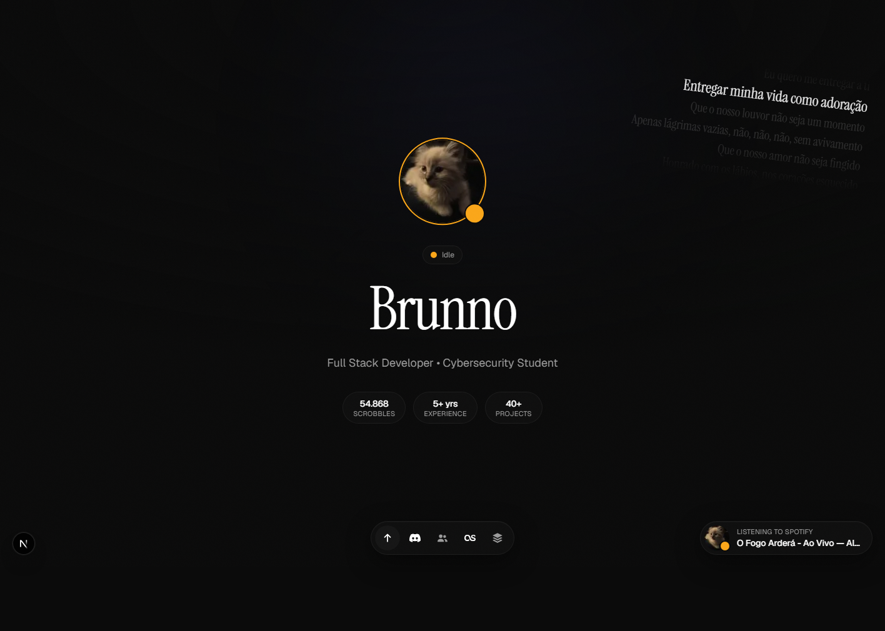
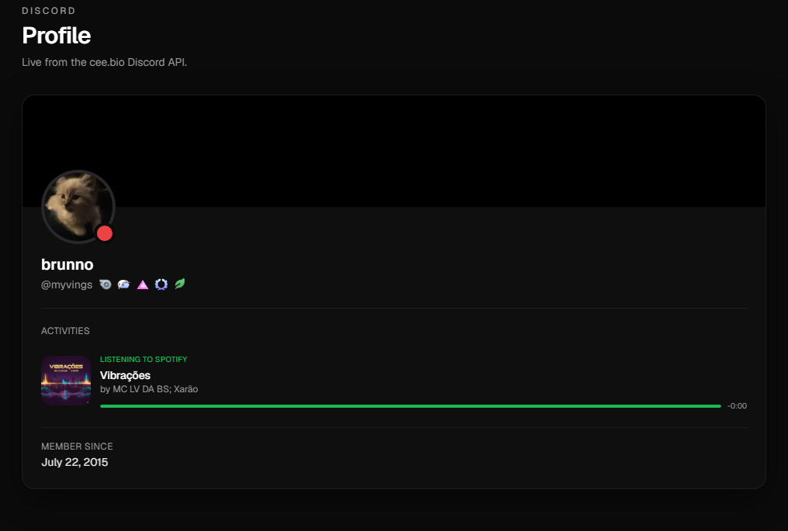
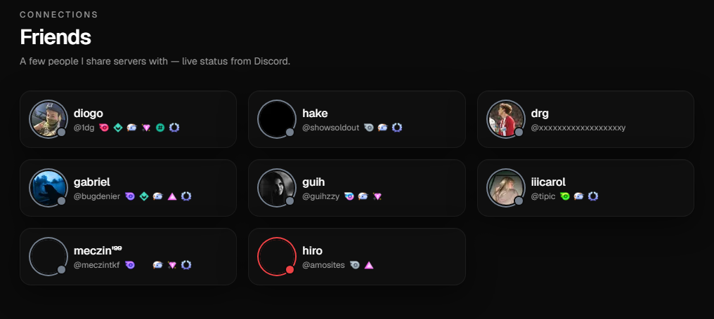
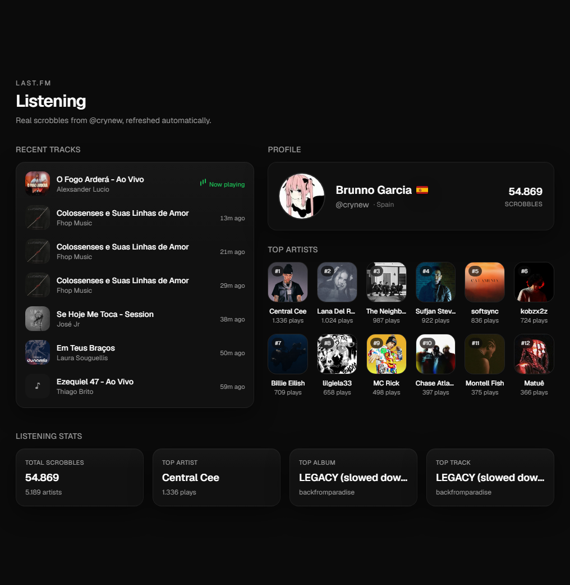

# brunno.lat

My personal site — a dark, motion-driven portfolio that pulls **live data** from Discord, Last.fm and GitHub. Real-time presence, the music I'm scrobbling, an animated lyrics ticker, and the people I share servers with, all in one page.

🔗 **Live:** [brunno.lat](https://brunno.lat)

<p align="center">
  
</p>

---

## ✨ Features

- **Live Discord presence** — avatar, status, badges and current Spotify activity, streamed from the [cee.bio](https://cee.bio) API (REST + WebSocket).
- **Friends grid** — people I share servers with, each with their own live Discord status and badges.
- **Last.fm listening** — now-playing + recent tracks, top artists/albums/tracks and lifetime stats. Artist photos are resolved through Deezer (Last.fm stopped serving them).
- **Animated lyrics ticker** — synced lyrics for the currently playing track, fetched via Musixmatch/cee.bio.
- **Motion everywhere** — aurora background, cursor glow, noise overlay, staggered reveals and a floating dock — all built with [Motion](https://motion.dev), and fully disabled under `prefers-reduced-motion`.
- **Edge-cached** — every external call is wrapped in Next.js Cache Components (`use cache` + `cacheLife`) so the page stays fast and rate-limit friendly.

## 📸 Screenshots

| Discord presence | Friends |
|---|---|
|  |  |

| Last.fm — recent tracks & profile |
|---|
|  |

## 🧱 Tech Stack

- **[Next.js 16](https://nextjs.org)** (App Router + Cache Components / `cacheComponents`)
- **[React 19](https://react.dev)**
- **[TypeScript 5](https://www.typescriptlang.org)**
- **[Tailwind CSS 4](https://tailwindcss.com)**
- **[Motion 12](https://motion.dev)** for animation
- External data: **cee.bio** (Discord), **Last.fm API**, **Deezer** (artist art), **GitHub API**, **Musixmatch** (lyrics)

## 🚀 Getting Started

### Prerequisites

- Node.js 20+
- A free [Last.fm API key](https://www.last.fm/api/account/create)

### Setup

```bash
# 1. Install dependencies
npm install

# 2. Configure environment
cp .env.example .env.local
# then fill in the values (see below)

# 3. Run the dev server
npm run dev
```

Open [http://localhost:3000](http://localhost:3000).

### Environment variables

| Variable | Required | Description |
|---|---|---|
| `LASTFM_API_KEY` | ✅ | Last.fm API key — [create one here](https://www.last.fm/api/account/create). |
| `LASTFM_USER` | ✅ | Last.fm username to display (e.g. `crynew`). |
| `DISCORD_USER_ID` | ✅ | Public Discord user ID, consumed via cee.bio. |
| `RAPIDAPI_KEY` | ➖ | Optional RapidAPI key for the Instagram endpoint; falls back to a built-in key. |

> Secrets live in `.env.local`, which is git-ignored. Only `.env.example` is committed.

The Discord friends shown in the grid are configured in [`lib/constants.ts`](lib/constants.ts) (`DISCORD_FRIEND_IDS`).

### Scripts

| Command | What it does |
|---|---|
| `npm run dev` | Start the dev server on port `3000`. |
| `npm run build` | Production build. |
| `npm run start` | Serve the production build on port `3111`. |
| `npm run lint` | Run ESLint. |

## 📁 Project structure

```
app/                 App Router pages + API routes (lastfm, discord, lyrics)
components/
  sections/          Hero, Socials, Friends, LastFM, TechStack, Footer
  lastfm/  social/   Feature cards
  effects/  ui/      Background effects + design-system primitives
lib/                 Server-only data fetchers (discord, lastfm, github, lyrics, deezer)
  data/              Static content (profile, tech stack, country data)
types/               Shared TypeScript types
```

> **Note:** this project runs on a customized build of Next.js 16 — see [`AGENTS.md`](AGENTS.md). APIs and conventions may differ from stock Next.js; check `node_modules/next/dist/docs/` when in doubt.

## ☁️ Deployment

Deploys cleanly to any Node host that supports Next.js 16. Set the environment variables above in your hosting dashboard, then `npm run build && npm run start`.

---

<sub>© Brunno — Crafted with Next.js & Motion.</sub>
