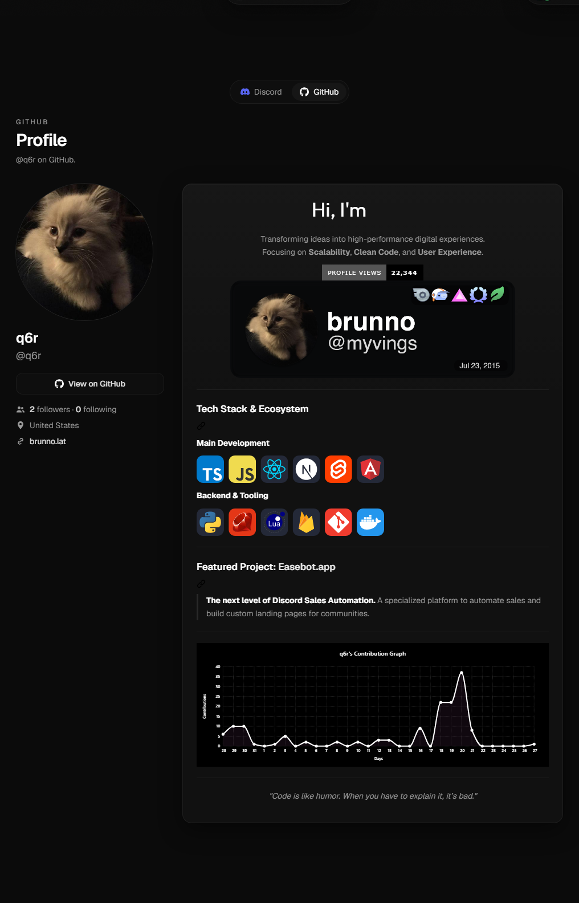

# brunno.lat

My personal site. A dark, animated portfolio that pulls live data from Discord, Last.fm and GitHub: my current status, what I'm listening to, synced lyrics, and the people I share servers with.

**Live:** [brunno.lat](https://brunno.lat)

<p align="center">
  
</p>

---

## Features

- **Live Discord presence.** Avatar, status, badges and current Spotify activity, streamed from the [cee.bio](https://cee.bio) API over REST and WebSocket.
- **Friends grid.** People I share servers with, each showing their own live Discord status.
- **Last.fm listening.** Now playing, recent tracks, top artists/albums/tracks and lifetime stats. Artist photos come from Deezer, since Last.fm stopped serving them.
- **Animated lyrics ticker.** Synced lyrics for whatever is playing, pulled from Musixmatch via cee.bio.
- **Lots of motion.** Aurora background, cursor glow, noise overlay, scroll reveals and a floating dock, all built with [Motion](https://motion.dev). Everything turns off when `prefers-reduced-motion` is set.
- **Cached at the edge.** Every external call is wrapped in Next.js Cache Components (`use cache` + `cacheLife`), so the page stays fast and doesn't hit rate limits.

## Screenshots

<table>
  <tr>
    <td align="center" width="50%"><b>Discord presence</b></td>
    <td align="center" width="50%"><b>Last.fm listening</b></td>
  </tr>
  <tr>
    <td></td>
    <td></td>
  </tr>
</table>

**Friends**


**GitHub profile**

<p align="center">
  
</p>

## Tech Stack

- **[Next.js 16](https://nextjs.org)** (App Router + Cache Components / `cacheComponents`)
- **[React 19](https://react.dev)**
- **[TypeScript 5](https://www.typescriptlang.org)**
- **[Tailwind CSS 4](https://tailwindcss.com)**
- **[Motion 12](https://motion.dev)** for animation
- External data: **cee.bio** (Discord), **Last.fm API**, **Deezer** (artist art), **GitHub API**, **Musixmatch** (lyrics)

## Getting Started

### Prerequisites

- Node.js 20+
- A free [Last.fm API key](https://www.last.fm/api/account/create)

### Setup

```bash
# 1. Install dependencies
npm install

# 2. Configure environment
cp .env.example .env.local
# then fill in the values (see below)

# 3. Run the dev server
npm run dev
```

Open [http://localhost:3000](http://localhost:3000).

### Environment variables

| Variable | Required | Description |
|---|---|---|
| `LASTFM_API_KEY` | ✅ | Last.fm API key. [Create one here](https://www.last.fm/api/account/create). |
| `LASTFM_USER` | ✅ | Last.fm username to display (e.g. `crynew`). |
| `DISCORD_USER_ID` | ✅ | Public Discord user ID, read through cee.bio. |

> Secrets live in `.env.local`, which is git-ignored. Only `.env.example` is committed.

> **Discord presence:** cee.bio only reads a user's badges and activities if its bot shares a server with them. If the socket returns no data for your `DISCORD_USER_ID`, join [discord.gg/erro](https://discord.gg/erro) so cee.bio can pick up your status, badges and activities.

The Discord friends shown in the grid are configured in [`lib/constants.ts`](lib/constants.ts) (`DISCORD_FRIEND_IDS`). The same applies to them: they each need to be in [discord.gg/erro](https://discord.gg/erro) to show up with live data.

### Scripts

| Command | What it does |
|---|---|
| `npm run dev` | Start the dev server on port `3000`. |
| `npm run build` | Production build. |
| `npm run start` | Serve the production build on port `3111`. |
| `npm run lint` | Run ESLint. |

## Project structure

```
app/                 App Router pages + API routes (lastfm, discord, lyrics)
components/
  sections/          Hero, Socials, Friends, LastFM, TechStack, Footer
  lastfm/  social/   Feature cards
  effects/  ui/      Background effects + design-system primitives
lib/                 Server-only data fetchers (discord, lastfm, github, lyrics, deezer)
  data/              Static content (profile, tech stack, country data)
types/               Shared TypeScript types
```

> **Note:** this project runs on a customized build of Next.js 16 (see [`AGENTS.md`](AGENTS.md)). Some APIs and conventions differ from stock Next.js, so check `node_modules/next/dist/docs/` when in doubt.

## Deployment

Runs on any Node host that supports Next.js 16. Set the environment variables above in your hosting dashboard, then run `npm run build && npm run start`.

## License

Released under the MIT License. See [LICENSE](LICENSE).

<sub>© 2026 Brunno. Built with Next.js and Motion.</sub>
